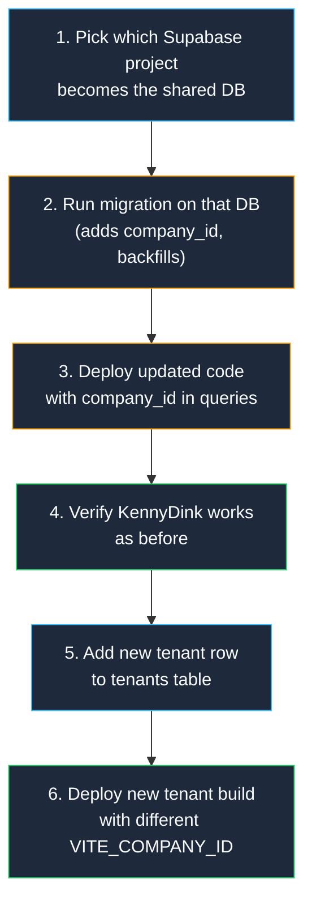

# Multi-Tenant Shared Database Conversion

Convert from **database-per-tenant** (separate Supabase projects) to **shared-database multi-tenancy** (one Supabase project, data isolated by `company_id` + RLS).

## Current State

| Aspect | Now |
|---|---|
| Database model | One Supabase project per tenant |
| Tenant isolation | Separate databases (physical isolation) |
| `VITE_COMPANY_ID` | Exists in config but **never used in queries** |
| `tenant_settings` | Singleton table (`CHECK (id = 1)`) |
| RLS policies | No tenant filtering — mostly `USING (true)` |
| Tables (6 data + 1 settings) | `courts`, `bookings`, `blocked_time_slots`, `qr_codes`, `admin_audit_logs`, `admin_users`, `tenant_settings` |

## User Review Required

> [!IMPORTANT]
> **Production Safety Strategy**: We will create a new migration that adds `company_id` columns and backfills existing KennyDink data. The migration is **additive only** — no columns are removed, no data is deleted. Your existing prod app continues working until you redeploy the updated code.

> [!WARNING]
> **Breaking Change for KennyDink**: Once the new RLS policies are applied, the old code (without `company_id` in queries) will return **empty results** because RLS will filter everything out. You must deploy the updated code **immediately after** running the migration. Plan for a brief maintenance window (~5 minutes).

> [!IMPORTANT]  
> **Tenant Identification Strategy**: I recommend using `VITE_COMPANY_ID` (which you already have) passed through the app to every query. This is the simplest approach — each deployment/build gets its own `.env` with the `company_id`, and all queries filter by it. Alternative approaches (JWT claims, subdomain routing) are more complex and not needed at your scale.

## Open Questions

> [!IMPORTANT]
> **Q1: KennyDink's `company_id` value** — Your `.env.kennydink` has `VITE_COMPANY_ID=kennydink_moalboal`. Should we use this exact string as the `company_id` for backfilling existing prod data? Or would you prefer something shorter like `kennydink`?

*use shorter like `kennydink*

> [!IMPORTANT]
> **Q2: Storage buckets** — Currently you have shared buckets (`court-images`, `qr-images`, `booking-proofs`, `cms-images`). Two options:
> - **Option A**: Prefix file paths with `company_id` (e.g., `kennydink_moalboal/court-1.jpg`). Simpler, no bucket changes needed.
> - **Option B**: Create separate buckets per tenant. More isolation but more management overhead.
> I recommend **Option A**.

**Let's go with Option A**

> [!IMPORTANT]
> **Q3: Admin user sharing** — Can one admin user manage multiple tenants? Or is each admin strictly tied to one tenant? This affects whether `admin_users` gets a `company_id` or a junction table.

**Multiple tenants, each admin is strictly tied to one tenant.**

> [!IMPORTANT]
> **Q4: Migration execution** — Do you want me to:
> - **Option A**: Generate the SQL migration file that you run manually via Supabase Dashboard / CLI
> - **Option B**: Also set up the Supabase CLI for local dev with branching support
> I recommend **Option A** to start, since you already have a prod database.

**Option A**
---

## Proposed Changes

### Phase 1: Database Migration (SQL)

#### [NEW] [supabase/migrations/XXXXXX_add_multi_tenancy.sql](file:///c:/Users/Rochelle/Desktop/Multi-Tenant-Pickleball-Court-Booking-System/supabase/migrations)

A single migration that does everything atomically:

**Step 1 — Create `tenants` registry table**
```sql
CREATE TABLE public.tenants (
  id text PRIMARY KEY,                    -- e.g., 'kennydink_moalboal'
  name text NOT NULL,                      -- e.g., 'KennyDink Moalboal'
  slug text UNIQUE NOT NULL,              -- URL-friendly, e.g., 'kennydink'
  is_active boolean DEFAULT true,
  created_at timestamptz DEFAULT now()
);

-- Seed with existing tenant
INSERT INTO tenants (id, name, slug)
VALUES ('kennydink_moalboal', 'KennyDink Pickleball', 'kennydink');
```

**Step 2 — Add `company_id` to all data tables**
```sql
-- Add column with default (so existing rows get backfilled)
ALTER TABLE courts ADD COLUMN company_id text 
  DEFAULT 'kennydink_moalboal' REFERENCES tenants(id);
ALTER TABLE bookings ADD COLUMN company_id text 
  DEFAULT 'kennydink_moalboal' REFERENCES tenants(id);
ALTER TABLE blocked_time_slots ADD COLUMN company_id text 
  DEFAULT 'kennydink_moalboal' REFERENCES tenants(id);
ALTER TABLE qr_codes ADD COLUMN company_id text 
  DEFAULT 'kennydink_moalboal' REFERENCES tenants(id);
ALTER TABLE admin_audit_logs ADD COLUMN company_id text 
  DEFAULT 'kennydink_moalboal' REFERENCES tenants(id);
ALTER TABLE admin_users ADD COLUMN company_id text 
  DEFAULT 'kennydink_moalboal' REFERENCES tenants(id);

-- Make NOT NULL after backfill
ALTER TABLE courts ALTER COLUMN company_id SET NOT NULL;
ALTER TABLE bookings ALTER COLUMN company_id SET NOT NULL;
ALTER TABLE blocked_time_slots ALTER COLUMN company_id SET NOT NULL;
ALTER TABLE qr_codes ALTER COLUMN company_id SET NOT NULL;
ALTER TABLE admin_audit_logs ALTER COLUMN company_id SET NOT NULL;
ALTER TABLE admin_users ALTER COLUMN company_id SET NOT NULL;

-- Remove defaults (new inserts must specify company_id explicitly)
ALTER TABLE courts ALTER COLUMN company_id DROP DEFAULT;
ALTER TABLE bookings ALTER COLUMN company_id DROP DEFAULT;
ALTER TABLE blocked_time_slots ALTER COLUMN company_id DROP DEFAULT;
ALTER TABLE qr_codes ALTER COLUMN company_id DROP DEFAULT;
ALTER TABLE admin_audit_logs ALTER COLUMN company_id DROP DEFAULT;
ALTER TABLE admin_users ALTER COLUMN company_id DROP DEFAULT;

-- Add indexes for query performance
CREATE INDEX idx_courts_company ON courts(company_id);
CREATE INDEX idx_bookings_company ON bookings(company_id);
CREATE INDEX idx_blocked_slots_company ON blocked_time_slots(company_id);
CREATE INDEX idx_qr_codes_company ON qr_codes(company_id);
CREATE INDEX idx_audit_logs_company ON admin_audit_logs(company_id);
CREATE INDEX idx_admin_users_company ON admin_users(company_id);
```

**Step 3 — Convert `tenant_settings` from singleton to multi-tenant**
```sql
-- Remove the singleton constraint
ALTER TABLE tenant_settings DROP CONSTRAINT IF EXISTS tenant_settings_pkey;
ALTER TABLE tenant_settings DROP CONSTRAINT IF EXISTS tenant_settings_id_check;

-- Add company_id as new primary key
ALTER TABLE tenant_settings ADD COLUMN company_id text 
  REFERENCES tenants(id);
UPDATE tenant_settings SET company_id = 'kennydink_moalboal' WHERE id = 1;
ALTER TABLE tenant_settings ALTER COLUMN company_id SET NOT NULL;

-- Drop old id column, make company_id the PK
ALTER TABLE tenant_settings DROP COLUMN id;
ALTER TABLE tenant_settings ADD PRIMARY KEY (company_id);
```

**Step 4 — Rewrite ALL RLS policies**
```sql
-- === COURTS ===
DROP POLICY IF EXISTS "Courts are viewable by everyone" ON courts;
DROP POLICY IF EXISTS "Authenticated users can insert courts" ON courts;
DROP POLICY IF EXISTS "Only admin users can update courts" ON courts;
DROP POLICY IF EXISTS "Authenticated users can delete courts" ON courts;

-- Public can view courts for ANY tenant (needed for customer booking page)
CREATE POLICY "courts_select_public" ON courts FOR SELECT USING (true);
-- Admins can only insert/update/delete courts for their own tenant
CREATE POLICY "courts_insert_admin" ON courts FOR INSERT TO authenticated
  WITH CHECK (
    EXISTS (SELECT 1 FROM admin_users WHERE id = auth.uid() AND company_id = courts.company_id)
  );
CREATE POLICY "courts_update_admin" ON courts FOR UPDATE TO authenticated
  USING (
    EXISTS (SELECT 1 FROM admin_users WHERE id = auth.uid() AND company_id = courts.company_id)
  );
CREATE POLICY "courts_delete_admin" ON courts FOR DELETE TO authenticated
  USING (
    EXISTS (SELECT 1 FROM admin_users WHERE id = auth.uid() AND company_id = courts.company_id)
  );

-- === BOOKINGS ===
DROP POLICY IF EXISTS "Bookings are viewable by everyone" ON bookings;
DROP POLICY IF EXISTS "Anyone can insert bookings" ON bookings;
DROP POLICY IF EXISTS "Anyone can update bookings" ON bookings;
DROP POLICY IF EXISTS "Authenticated users can delete bookings" ON bookings;

CREATE POLICY "bookings_select_public" ON bookings FOR SELECT USING (true);
CREATE POLICY "bookings_insert_public" ON bookings FOR INSERT WITH CHECK (true);
CREATE POLICY "bookings_update_public" ON bookings FOR UPDATE USING (true);
CREATE POLICY "bookings_delete_admin" ON bookings FOR DELETE TO authenticated
  USING (
    EXISTS (SELECT 1 FROM admin_users WHERE id = auth.uid() AND company_id = bookings.company_id)
  );

-- === BLOCKED_TIME_SLOTS ===
DROP POLICY IF EXISTS "Blocked time slots are viewable by everyone" ON blocked_time_slots;
DROP POLICY IF EXISTS "Authenticated users can insert blocked_time_slots" ON blocked_time_slots;
DROP POLICY IF EXISTS "Authenticated users can update blocked_time_slots" ON blocked_time_slots;
DROP POLICY IF EXISTS "Authenticated users can delete blocked_time_slots" ON blocked_time_slots;

CREATE POLICY "blocked_slots_select_public" ON blocked_time_slots FOR SELECT USING (true);
CREATE POLICY "blocked_slots_insert_admin" ON blocked_time_slots FOR INSERT TO authenticated
  WITH CHECK (
    EXISTS (SELECT 1 FROM admin_users WHERE id = auth.uid() AND company_id = blocked_time_slots.company_id)
  );
CREATE POLICY "blocked_slots_update_admin" ON blocked_time_slots FOR UPDATE TO authenticated
  USING (
    EXISTS (SELECT 1 FROM admin_users WHERE id = auth.uid() AND company_id = blocked_time_slots.company_id)
  );
CREATE POLICY "blocked_slots_delete_admin" ON blocked_time_slots FOR DELETE TO authenticated
  USING (
    EXISTS (SELECT 1 FROM admin_users WHERE id = auth.uid() AND company_id = blocked_time_slots.company_id)
  );

-- === QR_CODES ===
DROP POLICY IF EXISTS "QR codes are viewable by everyone" ON qr_codes;
DROP POLICY IF EXISTS "Authenticated users can insert qr_codes" ON qr_codes;
DROP POLICY IF EXISTS "Authenticated users can update qr_codes" ON qr_codes;
DROP POLICY IF EXISTS "Authenticated users can delete qr_codes" ON qr_codes;

CREATE POLICY "qr_select_public" ON qr_codes FOR SELECT USING (true);
CREATE POLICY "qr_insert_admin" ON qr_codes FOR INSERT TO authenticated
  WITH CHECK (
    EXISTS (SELECT 1 FROM admin_users WHERE id = auth.uid() AND company_id = qr_codes.company_id)
  );
CREATE POLICY "qr_update_admin" ON qr_codes FOR UPDATE TO authenticated
  USING (
    EXISTS (SELECT 1 FROM admin_users WHERE id = auth.uid() AND company_id = qr_codes.company_id)
  );
CREATE POLICY "qr_delete_admin" ON qr_codes FOR DELETE TO authenticated
  USING (
    EXISTS (SELECT 1 FROM admin_users WHERE id = auth.uid() AND company_id = qr_codes.company_id)
  );

-- === ADMIN_USERS ===
DROP POLICY IF EXISTS "Admin users are viewable by everyone" ON admin_users;
DROP POLICY IF EXISTS "Authenticated users can insert admin_users" ON admin_users;
DROP POLICY IF EXISTS "Authenticated users can update admin_users" ON admin_users;

CREATE POLICY "admin_users_select" ON admin_users FOR SELECT USING (true);
CREATE POLICY "admin_users_insert_auth" ON admin_users FOR INSERT TO authenticated
  WITH CHECK (true);
CREATE POLICY "admin_users_update_self" ON admin_users FOR UPDATE TO authenticated
  USING (id = auth.uid());

-- === ADMIN_AUDIT_LOGS ===
DROP POLICY IF EXISTS "Admin users can view audit logs" ON admin_audit_logs;
DROP POLICY IF EXISTS "Admin users can insert audit logs" ON admin_audit_logs;
DROP POLICY IF EXISTS "Admin users can delete audit logs" ON admin_audit_logs;

CREATE POLICY "audit_select_admin" ON admin_audit_logs FOR SELECT TO authenticated
  USING (
    EXISTS (SELECT 1 FROM admin_users WHERE id = auth.uid() AND company_id = admin_audit_logs.company_id)
  );
CREATE POLICY "audit_insert_admin" ON admin_audit_logs FOR INSERT TO authenticated
  WITH CHECK (
    EXISTS (SELECT 1 FROM admin_users WHERE id = auth.uid() AND company_id = admin_audit_logs.company_id)
  );
CREATE POLICY "audit_delete_admin" ON admin_audit_logs FOR DELETE TO authenticated
  USING (
    EXISTS (SELECT 1 FROM admin_users WHERE id = auth.uid() AND company_id = admin_audit_logs.company_id)
  );

-- === TENANT_SETTINGS ===
DROP POLICY IF EXISTS "Tenant settings are viewable by everyone" ON tenant_settings;
DROP POLICY IF EXISTS "Authenticated users can insert tenant settings" ON tenant_settings;
DROP POLICY IF EXISTS "Authenticated users can update tenant settings" ON tenant_settings;
DROP POLICY IF EXISTS "Authenticated users can delete tenant settings" ON tenant_settings;

CREATE POLICY "settings_select_public" ON tenant_settings FOR SELECT USING (true);
CREATE POLICY "settings_update_admin" ON tenant_settings FOR UPDATE TO authenticated
  USING (
    EXISTS (SELECT 1 FROM admin_users WHERE id = auth.uid() AND company_id = tenant_settings.company_id)
  );
CREATE POLICY "settings_insert_admin" ON tenant_settings FOR INSERT TO authenticated
  WITH CHECK (
    EXISTS (SELECT 1 FROM admin_users WHERE id = auth.uid() AND company_id = tenant_settings.company_id)
  );

-- === TENANTS (new table) ===
ALTER TABLE tenants ENABLE ROW LEVEL SECURITY;
CREATE POLICY "tenants_select_public" ON tenants FOR SELECT USING (true);
CREATE POLICY "tenants_insert_super" ON tenants FOR INSERT TO authenticated WITH CHECK (false);
-- Only manual/super-admin inserts for now
```

**Step 5 — Update RPC functions**
```sql
-- Drop and recreate create_booking_atomic with company_id parameter
CREATE OR REPLACE FUNCTION create_booking_atomic(
  p_court_id uuid,
  p_customer_name text,
  p_customer_email text,
  p_customer_phone text,
  p_booking_date date,
  p_start_time time,
  p_end_time time,
  p_total_price numeric,
  p_notes text,
  p_booked_times jsonb,
  p_company_id text  -- NEW PARAMETER
) RETURNS jsonb AS $$
DECLARE
  v_booking_id uuid;
  v_conflict_count integer;
  v_lock_key bigint;
BEGIN
  v_lock_key := hashtext(p_court_id::text || p_booking_date::text || p_company_id);
  PERFORM pg_advisory_xact_lock(v_lock_key);

  SELECT count(*) INTO v_conflict_count
  FROM bookings b
  WHERE b.court_id = p_court_id
    AND b.booking_date = p_booking_date
    AND b.status != 'Cancelled'
    AND b.company_id = p_company_id  -- TENANT FILTER
    AND b.booked_times ?| ARRAY(SELECT jsonb_array_elements_text(p_booked_times));

  IF v_conflict_count > 0 THEN
    RETURN jsonb_build_object('success', false, 'error', 'TIME_CONFLICT');
  END IF;

  SELECT count(*) INTO v_conflict_count
  FROM blocked_time_slots bts
  WHERE bts.court_id = p_court_id
    AND bts.blocked_date = p_booking_date
    AND bts.company_id = p_company_id  -- TENANT FILTER
    AND bts.time_slot IN (SELECT jsonb_array_elements_text(p_booked_times));

  IF v_conflict_count > 0 THEN
    RETURN jsonb_build_object('success', false, 'error', 'BLOCKED_SLOT');
  END IF;

  INSERT INTO bookings (court_id, customer_name, customer_email, customer_phone,
    booking_date, start_time, end_time, total_price, notes, booked_times, 
    status, company_id)
  VALUES (p_court_id, p_customer_name, p_customer_email, p_customer_phone,
    p_booking_date, p_start_time, p_end_time, p_total_price, p_notes, 
    p_booked_times, 'Confirmed', p_company_id)
  RETURNING id INTO v_booking_id;

  RETURN jsonb_build_object('success', true, 'booking_id', v_booking_id);
END;
$$ LANGUAGE plpgsql SECURITY DEFINER;

-- Similar update for reschedule_booking_atomic (add p_company_id parameter)
```

---

### Phase 2: App Configuration Layer

#### [MODIFY] [config.js](file:///c:/Users/Rochelle/Desktop/Multi-Tenant-Pickleball-Court-Booking-System/src/lib/config.js)
- Export `getCompanyId()` helper function that returns `import.meta.env.VITE_COMPANY_ID`
- Used by all services as the single source of truth for tenant identity

#### [MODIFY] [supabaseClient.js](file:///c:/Users/Rochelle/Desktop/Multi-Tenant-Pickleball-Court-Booking-System/src/lib/supabaseClient.js)
- No changes needed — all tenants now share the same Supabase URL/key

---

### Phase 3: Service Layer Updates (7 files)

Every service file needs the same pattern applied: **add `company_id` filter to every query**.

#### [MODIFY] [courts.js](file:///c:/Users/Rochelle/Desktop/Multi-Tenant-Pickleball-Court-Booking-System/src/services/courts.js)
- All `.select()` calls get `.eq('company_id', getCompanyId())`
- All `.insert()` calls include `company_id: getCompanyId()`
- Blocked time slot queries also get company_id filter
- Real-time subscriptions filter by `company_id`

#### [MODIFY] [booking.js](file:///c:/Users/Rochelle/Desktop/Multi-Tenant-Pickleball-Court-Booking-System/src/services/booking.js)
- All booking CRUD operations filtered by `company_id`
- `createBookingAtomic()` passes `p_company_id` to RPC
- `rescheduleBookingAtomic()` passes `p_company_id` to RPC
- Conflict detection queries filtered by `company_id`
- Real-time subscription filtered by `company_id`
- Storage paths prefixed: `${getCompanyId()}/proof-of-payment/...`

#### [MODIFY] [qrCodes.js](file:///c:/Users/Rochelle/Desktop/Multi-Tenant-Pickleball-Court-Booking-System/src/services/qrCodes.js)
- CRUD + storage paths prefixed with company_id

#### [MODIFY] [auditLogs.js](file:///c:/Users/Rochelle/Desktop/Multi-Tenant-Pickleball-Court-Booking-System/src/services/auditLogs.js)
- Insert/select/delete filtered by `company_id`

#### [MODIFY] [settings.js](file:///c:/Users/Rochelle/Desktop/Multi-Tenant-Pickleball-Court-Booking-System/src/services/settings.js)
- `getTenantSettings()`: query by `.eq('company_id', getCompanyId())` instead of `.eq('id', 1)`
- `updateTenantSettings()`: update by `company_id` instead of `id`

#### [MODIFY] [auth.js](file:///c:/Users/Rochelle/Desktop/Multi-Tenant-Pickleball-Court-Booking-System/src/services/auth.js)
- `signUp()`: insert into `admin_users` with `company_id`
- `isAdmin()`: check `admin_users` with both `id` AND `company_id` filter
- This ensures an admin for Tenant A cannot access Tenant B's admin panel

#### [MODIFY] [cmsImages.js](file:///c:/Users/Rochelle/Desktop/Multi-Tenant-Pickleball-Court-Booking-System/src/services/cmsImages.js)
- Storage path prefix: `${getCompanyId()}/cms/...`

---

### Phase 4: Provider & Component Updates

#### [MODIFY] [CompanyProvider.jsx](file:///c:/Users/Rochelle/Desktop/Multi-Tenant-Pickleball-Court-Booking-System/src/lib/CompanyProvider.jsx)
- Fetch `tenant_settings` by `company_id` instead of `id = 1`

#### Component changes (minimal)
- Most components receive data through services/providers, so they need **no changes**
- Only components that directly query Supabase (if any) need updates

---

### Phase 5: Environment & Deployment

#### [MODIFY] [.env.kennydink](file:///c:/Users/Rochelle/Desktop/Multi-Tenant-Pickleball-Court-Booking-System/.env.kennydink)
- Change `VITE_SUPABASE_URL` to shared project URL
- Change `VITE_SUPABASE_ANON_KEY` to shared project anon key
- Keep `VITE_COMPANY_ID=kennydink_moalboal`

#### [MODIFY] [.env.testclient](file:///c:/Users/Rochelle/Desktop/Multi-Tenant-Pickleball-Court-Booking-System/.env.testclient)
- Same shared Supabase URL/key
- Keep `VITE_COMPANY_ID=client_001`

#### [MODIFY] [.env.example](file:///c:/Users/Rochelle/Desktop/Multi-Tenant-Pickleball-Court-Booking-System/.env.example)
- Update template with shared database note
- Document that `VITE_COMPANY_ID` must match a row in `tenants` table

---

## Rollout Strategy (Protecting Prod)



### Safe Approach:
1. **Use the KennyDink Supabase project** as the shared DB (it already has prod data)
2. Run the migration — it's **additive only** (adds columns, backfills, rewrites RLS)
3. Deploy updated app code — all existing functionality preserved, just scoped by `company_id`
4. Existing KennyDink data untouched — just gets a `company_id` column with their value
5. New tenants: insert a row in `tenants`, create `tenant_settings`, deploy with new env

### If you want extra safety:
- Clone the KennyDink DB to a new Supabase project first
- Test migration on the clone
- Once verified, run on prod

---

## Verification Plan

### Automated Tests
- Run the app with `npm run dev -- --mode kennydink` and verify:
  - Courts load correctly (filtered by company_id)
  - Bookings work (create, view, cancel)
  - Admin login works (scoped to company_id)
  - QR codes display correctly
  - CMS/settings editable

### Manual Verification
1. Create a second tenant in the `tenants` table
2. Run the app with `--mode testclient`
3. Verify **zero data** shows for the new tenant (fresh slate)
4. Create courts, bookings, etc. for tenant 2
5. Switch back to KennyDink mode — verify tenant 2's data is **invisible**
6. Verify storage uploads go to correct prefixed paths

### Database Verification
```sql
-- Verify all existing data got company_id
SELECT 'courts' as tbl, count(*) FROM courts WHERE company_id IS NULL
UNION ALL
SELECT 'bookings', count(*) FROM bookings WHERE company_id IS NULL
UNION ALL
SELECT 'admin_users', count(*) FROM admin_users WHERE company_id IS NULL;
-- All should return 0

-- Verify tenant isolation
SET request.jwt.claims = '{"sub": "some-other-tenant-admin-uuid"}';
SELECT * FROM courts; -- Should only see their tenant's courts
```
